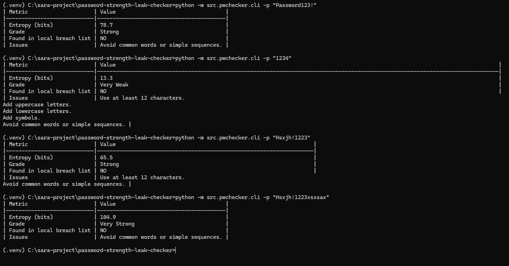

# 🔐 Password Strength & Leak Checker (Python)

A **local, privacy-first cybersecurity tool** that evaluates password strength and checks for leaked passwords **without using the internet**.  
Built entirely in Python as a personal cybersecurity learning project.

---

## 🧠 About the Project

This tool analyzes any password and reports:
- 🔢 **Entropy (bits)** – how unpredictable the password is  
- 🧩 **Strength grade** – from *Very Weak* to *Very Strong*  
- ⚠️ **Weak pattern detection** – flags common words or sequences  
- 🕵️ **Local leak check** – compares against a local breach list (no API calls)

✅ **Privacy-First:** all checks happen offline  
✅ **Educational Purpose:** helps users understand password hygiene  
✅ **Cybersecurity Relevance:** demonstrates log analysis, pattern detection, and local data handling

---

## ⚙️ Quick Start

To run locally:

```bash
git clone https://github.com/sara9202/password-strength-leak-checker.git
cd password-strength-leak-checker
python -m venv .venv
.venv\Scripts\activate
pip install -r requirements.txt
python -m src.pwchecker.cli -p "MyPassword123!"
```

You can also run it in interactive mode:
```bash
python -m src.pwchecker.cli
```

---

## 🧪 Example Results

| Metric | Value |
|--------|--------|
| Entropy (bits) | 78.7 |
| Grade | Strong |
| Found in local breach list | NO |
| Issues | Avoid common words or simple sequences. |

---

## 📸 Demonstration Screenshot

Here’s an example of the tool testing different password strengths:




---

## 📂 Project Structure

```
password-strength-leak-checker/
├─ src/
│  └─ pwchecker/
│     ├─ __init__.py
│     ├─ entropy.py
│     ├─ checker.py
│     └─ cli.py
├─ data/
│  └─ common_passwords.txt
├─ docs/
│  └─ screenshots/cli_output.png
├─ requirements.txt
└─ README.md
```

---

## 🌐 Cybersecurity Learning Goals

This project helped me:
- Understand **password entropy and strength scoring**
- Practice **regex and pattern detection**
- Learn about **local data privacy in password security**
- Gain hands-on experience with **Python project structure and Git version control**

---

## 🛠️ Next Steps / Improvements
- [ ] Add SHA-1 hash-based leak list matching  
- [ ] Add JSON/CSV report output option  
- [ ] Build a simple web UI with Flask  
- [ ] Include a larger breach dataset for offline testing  

---

## 📜 License
Licensed under the [MIT License](LICENSE).

---

### 💬 Author
**Sara Ali (sara9202)**  
Cybersecurity student passionate about secure coding, privacy, and automation.  

